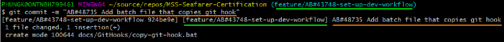
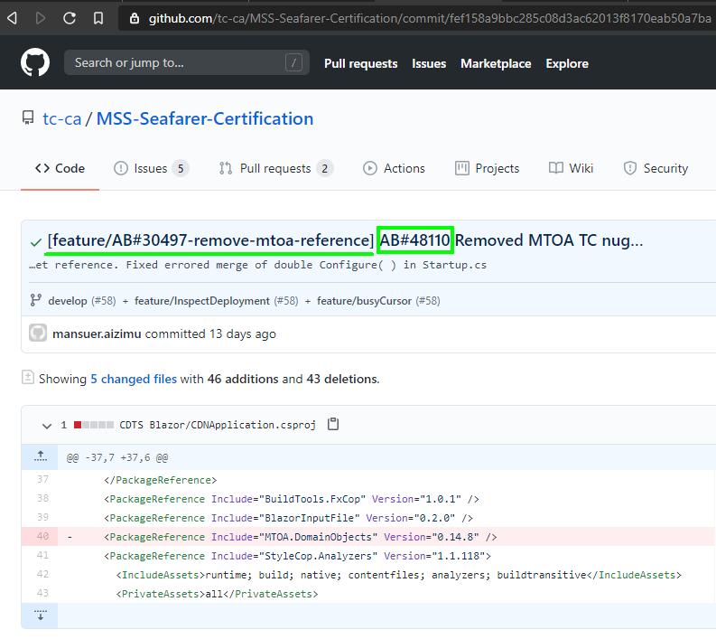
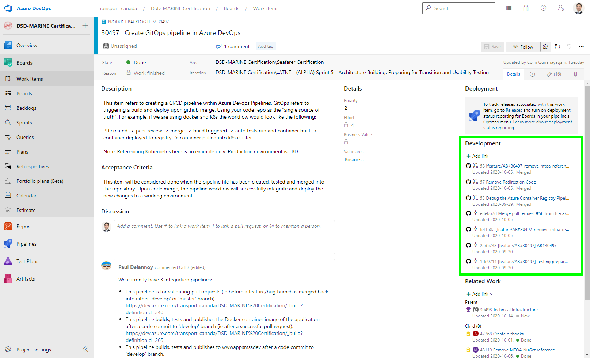
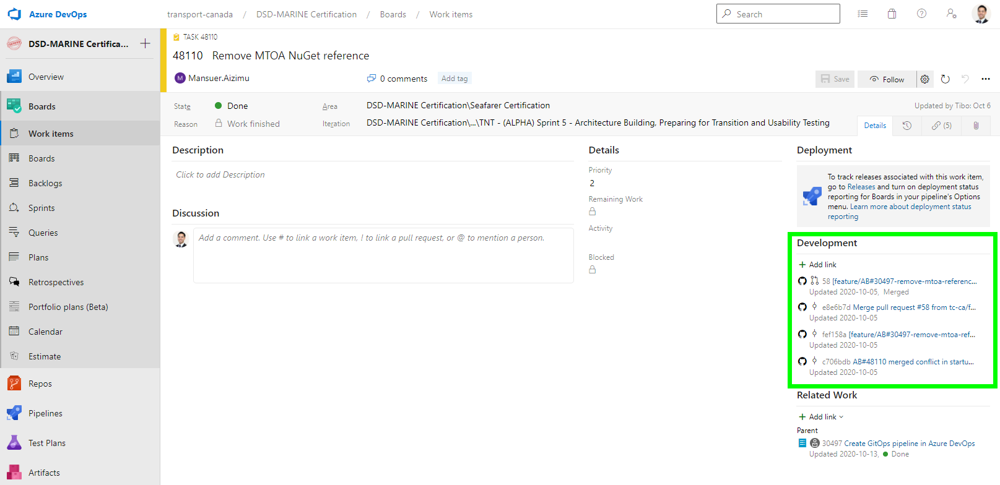

# Introduction 

This document will show you how to install this Git Hook and what it does.

# Installation

## Windows

Clone this repo locally and run `docs\GitHooks\copy-git-hook.bat`.

This will copy `prepare-commit-msg` to the `.git\hooks` folder.

# What this `Git Hook` does

It will prepend the branch name to your commit message.

# Why do we want this behaviour

This is to help with traceability. We are able to trace because we have linked our Azure DevOps Board with our GitHub Repository.

Linking a `commit` or `pull request` happens by including the following text in the message:

> `AB#xxxxx`

- `xxxxx` represents the Product Backlog Item (PBI) number or task number.
- Our branch naming convention starts with `AB#xxxxx` followed by a short description of the PBI. [See our GitOps README for more details](../GitOps/README.md).

## Trace backwards from a `commit`

You may look at a `commit` and wonder why it was done. Our branch naming convention + this `Git Hook` will automatically will link a `commit` to a PBI (see underlined text in image below).

If applicable, the committer will also reference the Task in the commit message (see box in image below)

## Trace backwards from a `PBI` or `Task`

Oftentimes when looking at a PBI or a Task, we would like to know how it was completed. Linking with `AB#xxxxx` achieves this.

### Product Backlog Item

### Task

# Resources / Further Reading

- https://docs.microsoft.com/en-us/azure/devops/boards/github/link-to-from-github?view=azure-devops
- https://docs.microsoft.com/en-us/azure/devops/boards/github/connect-to-github?view=azure-devops
- https://docs.microsoft.com/en-us/azure/devops/boards/github/?view=azure-devops

# Contribute

- [ ] create a Mac equivalent of the `batch` file for copying